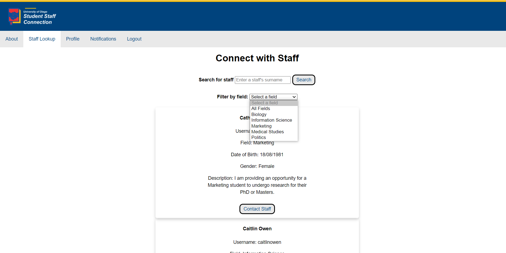

Student-Staff Research Connection
===============

Collaboration with : @hugonzb, @juliamcd19, @lhoogenraad, @cedric1910

## Overview
When applying for postgraduate studies (i.e., masters or PhD), several students contact our lecturers for opportunities. In many cases, the students contact lecturers that are not interested in the research work being proposed by the students. In such cases, the lecturer ends up contacting his/her colleagues to check whether they would be interested in the research proposed by the student. Sometimes however, this situation leads students to (i) receive delayed replies regarding postgraduate opportunities or (ii) simply being forgotten due to contacting the wrong lecturers. On the other hand, lecturers may disregard potential students because she or he doesn't know of other lecturers that can interested in the student's proposal. Our task was to come up with a software system that can manage the matching between the interests of students and lecturers.

This project was group work done for at my study abroad semester at the University of Otago in Dunedin, New Zealand. 

## Demo Screen Captures

## Feasibility Study

Practicality: 

This application provides a solution to the problem of connecting students and lecturers for research projects. Team members have the required technical knowledge to cover all aspects of the project and ensure functionality of user requirements. As described below, the scheduling is feasible within the time frame of 3 sprints which is spread across . Our variety of resources, including NetBeans and GitBucket, will provide us with necessary tools to work quickly and efficiently. With this approach, the application is practical to develop within the time frame and the resources provided. 

Technical: 

For our database management system (DBMS) our project team will incorporate H2, which will primarily act as the back-end of the database which will hold the details of students and lecturers. HTML/CSS will be used to create the front-end operations and website display. In terms of middleware and connections/operations between the back and front end, Java and JavaScript classes will be created which control and perform this.

The majority of us are familiar with Java, which we plan to use to design the backend. The member of the team who is unfamiliar with Java is well versed in front end tools. Three members are well versed in H2 for the database. Overall, the team is well prepared to use these tools to create the intended product. There may be some time and resources spent to counsel each other on the skills some of us do not know.  

Operations: 

Application will operate as a web service. The student will give information on what they want to study, and the web service should always return a list of ideal faculty members that they should contact. Hypothetically a connection to the Otago Universities Staff Database to get up-to-date information about the staff faculty that want to partner with PhD students. Also, if we could gain secure access, the student and staff evision log in portal would be ideal for login to the website, rather than having the users create new accounts. Being linked to Evision, the University of Otago IT department would be responsible for the future maintenance of this system.

Schedule: 

We estimate that the product could be created within the three iterations, with a finished product at the end of the semester. Between 5 people, over the course of 3 sprints, we could create a front end, backend/database and effectively integrate the two pieces, for a finished page of professor profiles that student users can filter. Ideally, if schedule permits, we will be able to also add robust student profiles and an elegant system for professors to approve contact. 

Resource: 

Time: We will collaborate on gitbucket, meaning that we can all work on different parts of the application at the same time. Additionally, we can work on the project from home etc., which allows us to spend extra time on finishing projects and sprints.

Money: We won’t be getting paid.

